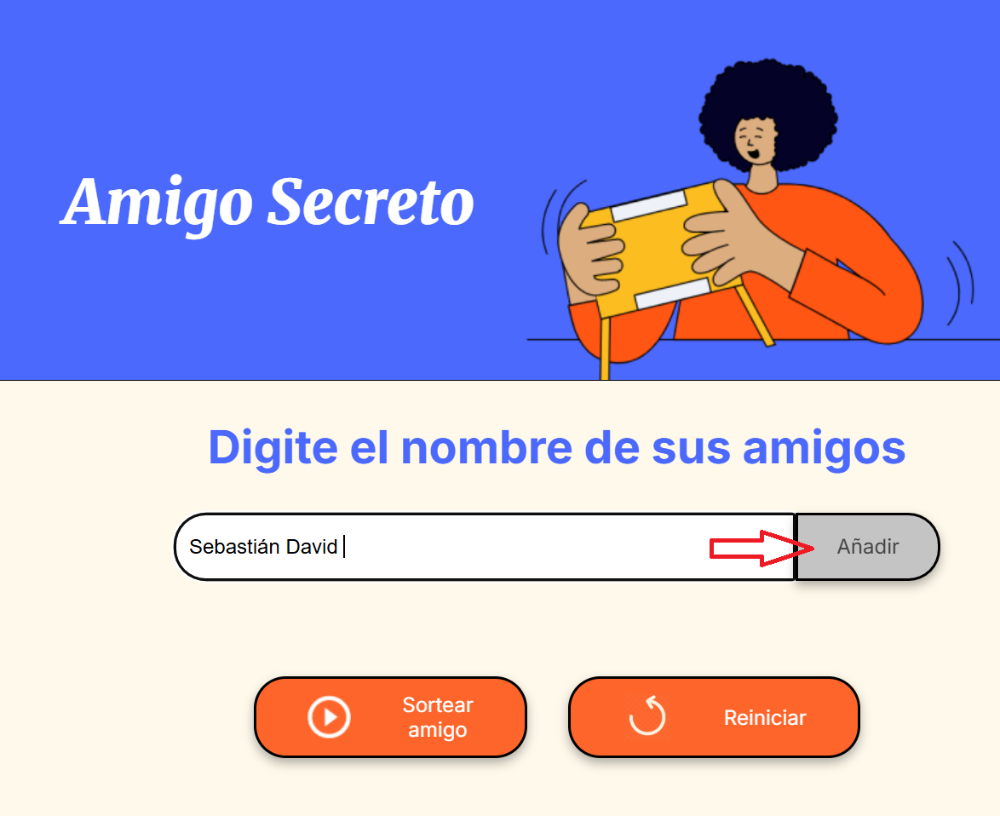
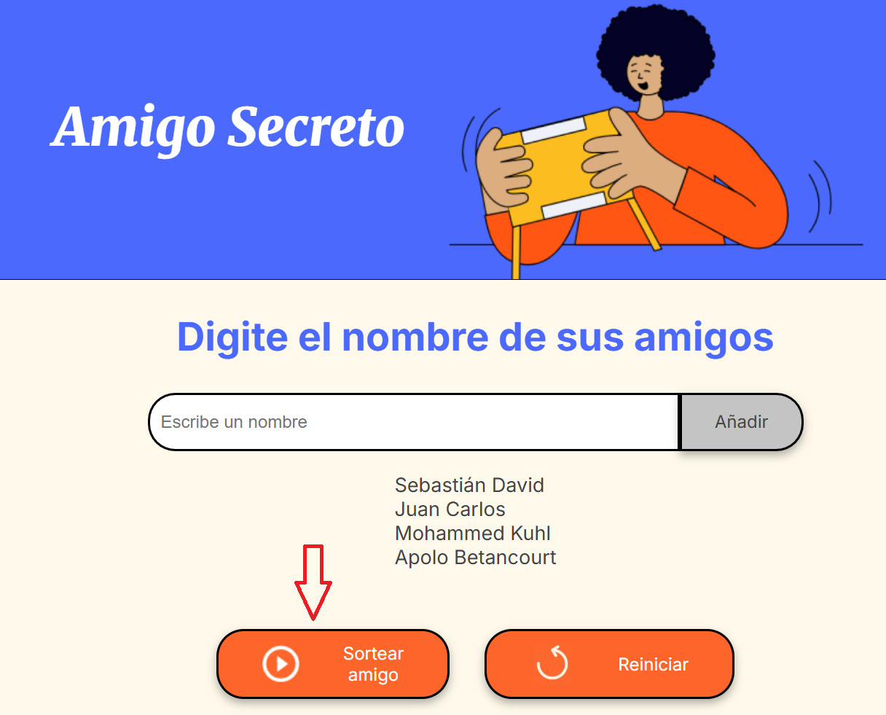
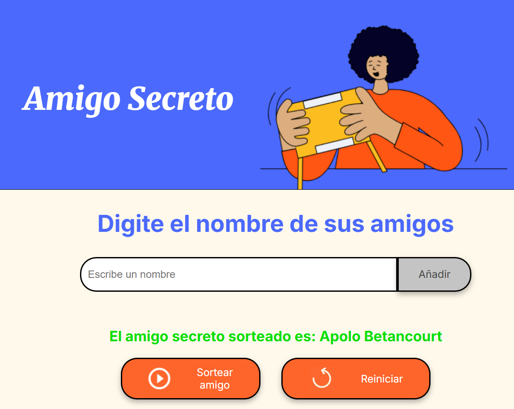
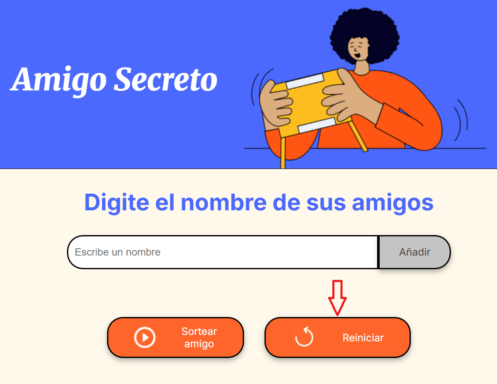

<h1 align="center">Ruleta de amigos</h1>

  

  
  

---

## Índice

- [Descripción](#descripción)  
- [Estado del Proyecto](#estado-del-proyecto)  
- [Funcionalidades](#funcionalidades)  
- [Demostración](#demostración)  
- [Cómo Ejecutar](#cómo-ejecutar)  
- [Tecnologías Utilizadas](#tecnologías-utilizadas)  
- [Contribución](#contribución)  
- [Autores](#autores)  
- [Licencia](#licencia)

---

## Descripción

**Amigo Secreto** es una aplicación web interactiva creada para organizar dinámicas de intercambio de nombres (como “Amigo Secreto”) con facilidad. Permite ingresar nombres en una lista, realizar un sorteo aleatorio, resaltar el nombre elegido, y reiniciar la dinámica para empezar nuevamente.

---

## Estado del Proyecto

🚧 **Finalizado** 🚧

---

## Funcionalidades

- **Agregar nombres**: Ingresas nombres en un campo de texto y se muestran automáticamente en una lista.
- **Sorteo aleatorio**: Al presionar el botón *“Sortear”*, se escoge un nombre al azar, se limpia la lista y se resalta el elegido.
- **Reiniciar**: Botón para borrar el nombre resaltado y permitir un nuevo sorteo.

---

## Demostración

A continuación puedes ver cómo se agregan los nombres y se realiza el sorteo:

  

  

  

  

*(Reemplaza las rutas con tus archivos reales; también puedes usar GIF o enlaces a videos hospedados en YouTube o GitHub)*

---

## Cómo Ejecutar

1. Solo selecciona el siguiente enlace:
    https://hollman-j.github.io/juego-amigo-secreto/
